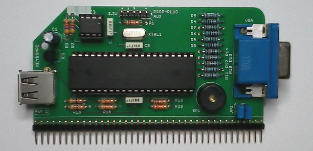

## Propeller ANSI / VT-100 Terminal

Firmware for a serial terminal add-on board designed for the [RC2014](http://http://rc2014.co.uk/) computer.
It adds VGA video output as 80x25 text (720x400@70Hz) with ANSI / VT-100 terminal emulation, and USB keyboard input.
Using a single [Parallax Propeller](https://www.parallax.com) microcontroller running at 80MHz.



### Terminal ANSI Codes

The following escape sequences can be used to control the terminal behaviour

 * **`\ESC[{COUNT}A`**  
       Move cursor up COUNT lines (default 1).  
 * **`\ESC[{COUNT}B`**  
       Move cursor down COUNT lines (default 1).  
 * **`\ESC[{COUNT}C`**  
       Move cursor right COUNT columns (default 1).  
 * **`\ESC[{COUNT}D`**  
       Move cursor left COUNT columns (default 1).  
 * **`\ESC[H`**  
       Move cursor to upper left corner.  
 * **`\ESC[{ROW];{COLUMN}H`**  
       Move cursor to screen location ROW,COLUMN.  
 * **`\ESC[f`**  
       Move cursor to upper left corner.  
 * **`\ESC[{ROW];{COLUMN}f`**  
       Move cursor to screen location ROW,COLUMN.  
 * **`\ESC[{COUNT}0K`**  
       Clear line from cursor right.  
 * **`\ESC[{COUNT}1K`**  
       Clear line from cursor left.  
 * **`\ESC[{COUNT}2K`**  
       Clear entire line.  
 * **`\ESC[{COUNT}0J`**  
       Clear screen from cursor down.  
 * **`\ESC[{COUNT}1J`**  
       Clear screen from cursor up.  
 * **`\ESC[{COUNT}2J`**  
       Clear entire screen.  
 * **`\ESC[{NUM1};...;{NUMn}m`**  
       Calls the graphics functions specified by the following values. These
       specified functions remain active until the next occurrence of this
       escape sequence. Graphics mode changes the colors and attributes of
       text (such as bold and underline) displayed on the screen.
       The following lists supported attributes:  
        **`0`** - All attributes off  
        **`1`** - Bright on  
        **`5`** - Blink on  
        **`30..37`** - Foreground color (black, red, green, yellow, blue, magenta, cyan, white)  
        **`38;5;{NUM}`** - Foreground color to {NUM} (0-15)  
        **`39;{NUM}`** - Default foreground color  
        **`40..47`** - Background color (black, red, green, yellow, blue, magenta, cyan, white)  
        **`48;5;{NUM}`** - Background color to {NUM} (0-7)  
        **`49;{NUM}`** - Default background color  
 * **`\ESC[6n`**  
       Reports the cursor position to the application as (as though typed at the
       keyboard) `\ESC[{ROW];{COLUMN}R`  
 * **`\ESC[s`**  
       Save current cursor position.  
 * **`\ESC[u`**  
       Restores the saved cursor position.  

Where `\ESC` is the binary character `1Bh (or 27)` and `{NUM}`, `{COUNT}`,
`{ROW}`, `{COLUMN}` is any sequence of numeric characters like `123`.

### Usage from BASIC

```
10 PRINT CHR$(27);"[1;31m";"TEXT IN RED";CHR$(27);"[39m"
```

### Parts List

* R1 = 220 ohm 1/4 watt
* R2 = 4.700 ohm 1/4 watt
* R3 = 4.700 ohm 1/4 watt
* R4 = 510 ohm 1% 1/4 watt
* R5 = 240 ohm 1% 1/4 watt
* R6 = 510 ohm 1% 1/4 watt
* R7 = 240 ohm 1% 1/4 watt
* R8 = 510 ohm 1% 1/4 watt
* R9 = 240 ohm 1% 1/4 watt
* R10 = 240 ohm 1% 1/4 watt
* R11 = 240 ohm 1% 1/4 watt
* R12 = 130 ohm 1% 1/4 watt
* R13 = 130 ohm 1% 1/4 watt
* R14 = 130 ohm 1% 1/4 watt
* R15 = 10.000 ohm 1/4 watt
* R16 = 10.000 ohm 1/4 watt
* R17 = 47.000 ohm 1/4 watt
* R18 = 47.000 ohm 1/4 watt
* R19 = 47 ohm 1/4 watt
* R20 = 47 ohm 1/4 watt
* R21 = 10.000 ohm 1/4 watt
* R22 = 22.000 ohm 1/4 watt
* C2 = 10 uF 63v elettr.
* C3 = 100.000 pF poli
* C4 = 100.000 pF poli
* C5 = 100.000 pF poli
* XTAL1 = 5 MHz crystal
* IC1 = LF33ABV
* IC2 = P8X32A-D40
* IC3 = 24LC512
* JP1 = 3 pin male header
* JP2 = 2 pin male header
* JP3 = 2 pin male header
* JP4 = 2 pin male header
* JP5 = 2 pin male header
* CN1 = USB-A connector
* CN2 = 40 pin male header, right angle
* CN3 = DB15 HD female connector
* CN4 = 5 pin male header

